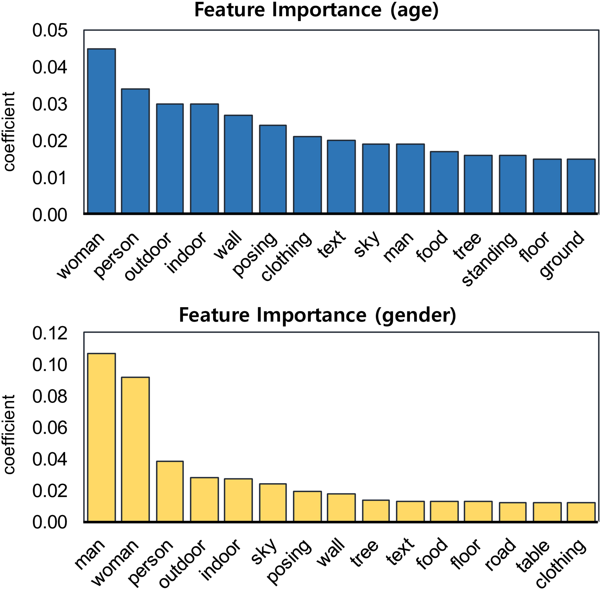

# Assignment 5 - pya209

## Assignment 1:
Analyzed Linda's citibike homework last week, and submitted as a git pull request markdown file to her repo PUI2018/lj_1232. 
File is called CitibikeReview_pya209.

## Assignment 2:
Worked partly in group with Siddhanth Shetty(sds695) for this. 

We shared results for the first two tests, I worked on ANOVA test and Siddhanth worked on Path Analysis. The third, Logistic Regression, I worked alone.

### ANOVA 

| **Statistical Analyses**	|  **IV(s)**  |  **IV type(s)** |  **DV(s)**  |  **DV type(s)**  |  **Control Var** | **Control Var type**  | **Question to be answered** | **_H0_** | **alpha** | **link to paper**| 
|:----------:|:----------|:------------|:-------------|:-------------|:------------|:------------- |:------------------|:----:|:-------:|:-------|
ANOVA	| 2, Age & Gender | Categorical | 1, Ratio to all topics for all users  | Continous | NA | 	NA | Are the differences in ratios between age and gender groups different ? | 1. Ratio(teens) = Ratio(adults) 2. Ratio(male) = Ratio(female) | 0.05 |[Is a picture really worth a thousand words?](https://journals.plos.org/plosone/article?id=10.1371/journal.pone.0204938#sec011) |
  |||||||||

| **Statistical Analyses**	|  **IV(s)**  |  **IV type(s)** |  **DV(s)**  |  **DV type(s)**  |  **Control Var** | **Control Var type**  | **Question to be answered** | **_H0_** | **alpha** | **link to paper**| 
|:----------:|:----------|:------------|:-------------|:-------------|:------------|:------------- |:------------------|:----:|:-------:|:-------|
Path analysis	| 5, women age (X1), place of residence (X2), religion (X3), socioeconomic status (X4), use of family planning methods (X5) | Categorical | 3,  women education (X6), age at first marriage (X7) and unwanted births (X8)  | Categorical | NA | 	NA | Which of the independent variables affected number of unwanted births? | The independent variables do not significantly affect the number of unwanted births. | 0.05,0.01 |[Correlates of Unwanted Births in Bangladesh: A Study through Path Analysis?](https://journals.plos.org/plosone/article?id=10.1371/journal.pone.0164007) |
  |||||||||

| **Statistical Analyses**	|  **IV(s)**  |  **IV type(s)** |  **DV(s)**  |  **DV type(s)**  |  **Control Var** | **Control Var type**  | **Question to be answered** | **_H0_** | **alpha** | **link to paper**| 
|:----------:|:----------|:------------|:-------------|:-------------|:------------|:------------- |:------------------|:----:|:-------:|:-------|
Logistic Regression	| 1,  Gender in different classes | Categorical | 1,  Proportion nomination to males  | Ordinal | NA | 	NA | Do males nominate males more for class performance? | Proportion of nominations to males(nominated by male) <= Proportion of nominations to males(nominated by females) | 0.05 |[Males Under-Estimate Academic Performance of Their Female Peers in Undergraduate Biology Classrooms](https://journals.plos.org/plosone/article?id=10.1371/journal.pone.0148405) |
  |||||||||
  
  
